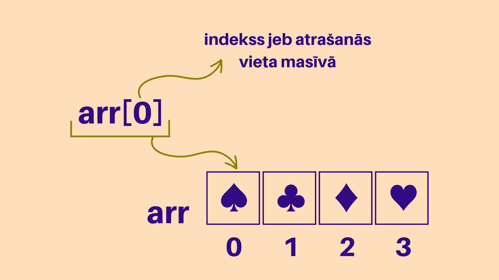
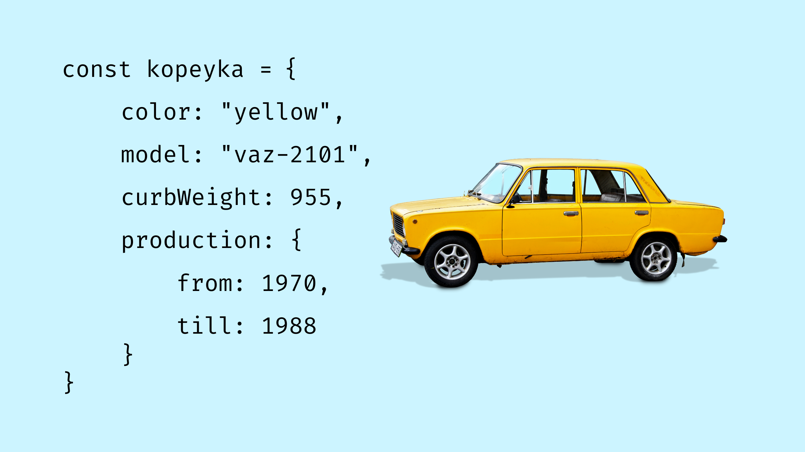

# Typescript basics

* [Ievads](#ievads)
* [Mainīgie](#mainīgie)
  * [let, const, var](#let-const-var)
    * [let](#let)
    * [const](#const)
    * [var](#var)
* [if ... else](#if--else)
  * [Truthy un falsy vērtības](#truthy-un-falsy-vērtības)
  * [Loģiskie operatori](#loģiskie-operatori)
  * [== un ===](#un)
  * [else un else if](#else-un-else-if)
  * [Nosacījuma operators jeb saīsinātais `if`](#nosacījuma-operators-jeb-saīsinātais-if)
* [Cikli](#cikli)
* [Funkcijas](#funkcijas)
  * [Funkciju izsaukšana](#funkciju-izsaukšana)
  * [Funkcijas parametri](#funkcijas-parametri)
  * [Noklusējuma funkciju parametri](#noklusējuma-funkciju-parametri)
  * [Bultiņu funkcijas](#bultiņu-funkcijas)
  * [Callback funkcijas](#callback-funkcijas)
* [Iebūvētās JS metodes](#iebūvētās-js-metodes)
* [Masīvi](#masīvi)
  * [Metodes](#metodes)
  * [Spread operators](#spread-operators)
* [Objekti](#objekti)
  * [Piekļūšana objektu vērtībām](#piekļūšana-objektu-vērtībām)
  * [Objektu tipi un interfeisi](#objektu-tipi-un-interfeisi)
  * [Objektu metodes](#objektu-metodes)
* [JS versijas](#js-versijas)
  * [TS uz JS, konfigurācija](#ts-uz-js-konfigurācija)
* [Kļūdu paziņojumi](#kļūdu-paziņojumi)
* [Klases](#klases)

## Ievads

TODO: Write an intro

* Javascript un Typescript nosaukumu lietošana kursā
* Ko šis kurss nosedz, ko nē. Kāpēc tikai basics un daudz kas izlaists
* Uzdevumu palaišana

TODO: Find a place for these random snippets of info

* camelCase, snake_case utt.
* komentāri kodā

## Mainīgie

JavaScript mainīgie ir kā konteineri, kuros tiek uzglabāti dažādi dati – teksts, skaitļi, masīvi u.c. Tie mums ļauj saglabāt datus un tos izmantot vēlāk kodā.

Mainīgo veidošana tiek saukta par mainīgo **deklarēšanu**. Lai deklarētu mainīgo, izvēlamies vienu no trim atslēgvārdiem (~~`var`~~, `let` vai `const`), nosaukumu un ar vienu vienādības zīmi piešķiram vērtību. Parasti programmēšanas valodas pieprasa mainīgā deklarācijas beigās likt semikolu, taču Javascript valodā tas nav obligāti.

Mainīgā nosaukumam jāsākas ar burtu vai `$`, vai `_`, tas nedrīkst sākties ar ciparu. Nosaucot mainīgos, vēlams tiem dot aprakstošus nosaukumus.

Tālāk mainīgajam varam piešķirt vērtību, kas tajā glabāsies. Vērtību mainīgajam piešķir, lietojot vienu vienādības zīmi:

```typescript
let myVariable = 'hello';
const myOtherVariable = 123;
const itsAnArray = [1, 1, 324];
```

### let, const, var

Javascript un Typescript valodās ir trīs dažādi atslēgvārdi, ar kuriem iespējams deklarēt mainīgos:

#### let

Ar atslēgvārdu `let` iespējams deklarēt bloka mēroga (*block scope*) mainīgo, kas nozīmē, ka tam nevar piekļūt ārpus konkrētā bloka. Bloku veido figūriekavas, kuras savukārt izmanto tādās konstrukcijās kā, piemēram, `if ... else`, `for` ciklos. Arī funkcijas sākumu un beigas nosaka figūriekavas, kas tāpat veido darbības zonu (*scope*), kurā var deklarēt un izmantot mainīgos.

```typescript
function f() {
  const a = 100;
  if (a > 99) {
    // Mainīgajam 'a' varam piekļūt, jo joprojām esam funkcijas darbības zonā
    const b = a + 1;
    console.log(b);
  }
  // Kļūda: 'b' šeit neeksistē, jo to esam deklarējuši if blokā un ārpus tā tas nav pieejams
  console.log(b);
};

// Kļūda: 'a' šeit neeksistē, jo piekļūt tam mēģinām ārpus funkcijas, kurā tas deklarēts
console.log(a);
```

Izmantojot `let` atslēgvārdu, atkārtoti deklarēt mainīgo nav iespējams, tomēr ir iespējams tam ar vienādības zīmi piešķirt jaunu vērtību.

```typescript
let name = 'Jānis';
let name = 'Pēteris'; // Kļūda, jo mainīgais ar nosaukumu name jau pastāv
name = 'Pēteris';

console.log(name) // Pēteris
```

#### const

Atslēgvārdam `const` piemīt visas īpašības, kas atslēgvārdam `let`, taču ar `const` deklarētam mainīgajam nevar tikt piešķirta jauna vērtība un tas nevar tikt mainīts. Tomēr, ja ar `const` deklarētā mainīgā vērtība ir [objekts](#objekti) vai [masīvs](#masīvi), ir iespējams mainīt to, kas atrodas masīvā vai objektā.

```typescript
const kitty = {
  name: "Minka",
  numLives: 9,
};

// Kļūda, jo mēģinām pārrakstīt mainīgā kitty vērtību ar pavisam citu objektu
kitty = {
  name: "Pūka",
  numLives: 9,
};

// Nav kļūdas, jo mainīta tiek name vērtība, nevis pats objekts
kitty.name = "Pūka";
```

Kā zināt, vai jālieto `let` vai `const`?

Parasti ir ieteicams visur izmantot `const`, ja vien jau mainīgā deklarācijas brīdī nav plānots nakotnē mainīgā vērtību izmainīt.

#### var

Atslēgvārds `var` ir novecojis un sastopams kodā, kas rakstīts, galvenokārt, pirms 2015. gada, kad valodai tika pievienoti pārējie deklarācijas atslēgvārdi. `var` piemīt unikālas īpašības, kuras var būt noderīgas pieredzējuša programmētāja arsenālā, taču mēs mainīgo deklarēšanā `var` neizmantosim, tāpēc aplūkosim daudz biežāk sastopamos `let` un `const`.

Svarīgi atcerēties, ka Javascript programmēšanas valodā ir nozīme lielo un mazo burtu lietojumam. Ja, piemēram, tiek deklarēti divi mainīgie `let myVar;` un `let MyVar;`, – JavaScript tos uztvers kā divus dažādus mainīgos. Tikpat svarīgi ir izvairīties no valodā esošo atslēgvārdu lietošanas mainīgo (arī funkciju) nosaukumos, piemēram,

🚫 `const number = 1;`

🚫 `const var = 'textValue';`

Typescript valodā, deklarējot mainīgos, tiem varam arī noteikt tipu, rakstot aiz mainīgā nosaukuma kolu un tipa nosaukumu.

```typescript
let myVariable: string = 'hello';
const myOtherVariable: number = 123;
const itsAnArray: number[] = [1, 1, 324];
const itsAnArray2: Array<number> = [1, 1, 324];
```

## if ... else

Rakstot kodu, mēs bieži vēlamies likt kādai koda daļai izpildīties atkarībā no kādiem nosacījumiem.

Piemēram, mūsu aplikācija seko līdzi laikapstākļu izmaiņām, un mēs vēlamies atgādināt lietotājam, ka šodien jāpaņem līdzi lietussargs.

```Typescript
const isRaining = true;

if(isRaining === true) {
  alert('Bring umbrella!');
}
```

Šajā piemērā mainīgā `isRaining` vērtība jau ir `boolean` vērtība, tāpēc salīdzinājumu ar `true` vai `false`  nav nepieciešams veikt.

```typescript
const isRaining = true;

if(isRaining) {
  alert('Bring umbrella!');
}
```

Pieņemsim, ka mūsu aplikācijai jāparāda paziņojums tikai tad, ja nokrišņu varbūtība pārsniedz 50%.

```typescript
const chanceOfRain = 40;

if(chanceOfRain > 50) {
  alert('Bring umbrella!');
}
```

Šajā piemērā salīdzinām divas vērtības. `chanceOfRain >= 50` būs `false`, jo `chanceOfRain` vērtība ir 40, kas, protams, nav vairāk par 50, tātad kods, kas atrodas iekš `if` konstrukcijas figūriekavām netiks izpildīts, un paziņojums netiks parādīts.

### Truthy un falsy vērtības

Patiesībā jebkura vērtība var tikt pārvērsta `boolean` vērtībā. Attiecīgi par `if` nosacījumu varam izmantot jebkuru vērtību. Tam arī nav jābūt salīdzinājumam.

Pieņemsim, ka mūsu aplikācijai jāparāda paziņojums tad, ja nokrišņu varbūtība ir vismaz 1%.

```typescript
const chanceOfRain: number = 1;

// Option 1
if(chanceOfRain > 0) {
  alert('Bring umbrella!');
}

// Option 2
if(chanceOfRain) {
  alert('Bring umbrella!');
}
```

Šajā piemērā paziņojums tiks parādīts abos gadījumos. Bet kā!? `chanceOfRain` taču ir vērtība ar tipu `number`!

Jā! Pastāv vien dažas `falsy` vērtības, piemēram, `0`, tukša `string` tipa vērtība `""`, `undefined`, `false`, `null` ([pilns saraksts @MDN](https://developer.mozilla.org/en-US/docs/Glossary/Falsy)), bet visas citas vērtības `if` konstrukcijā tiks uzskatīts par `truthy`. Tātad kods `alert('Bring umbrella!');` tiks izpildīts, ja `if` nosacījuma vietā būs skaitlis 1, teksts "yes" vai jebkura cita vērtība, kas nav `falsy`.

### Loģiskie operatori

Vienā `if` konstrukcijā varam izmantot arī vairākus nosacījumus, ja tie kopā attiecas uz koda daļu, kuru vēlamies izpildīt vai neizpildīt. Piemēram, mūsu aplikācijai jāparāda paziņojums tad, ja nokrišņu varbūtība pārsniedz 50%, bet vēja ātrums ir mazāks par 10m/s.

Apvienot vairākus nosacījumus vienā varam, izmantojot loģisko operatoru AND, ko Javascript valodā apzīmē ar `&&`. Ar AND operatoru kods if konstrukcijā izpildīsies tikai tad, ja patiesi būs visi nosacījumi.

```typescript
const chanceOfRain = 55;
const windSpeed = 5;

if(chanceOfRain > 50 && windspeed < 10) {
  alert('Bring umbrella!');
}
```

Šajā piemērā paziņojums tiks parādīts, jo patiesībai atbilst gan viens, gan otrs nosacījums.

Pieņemsim, ka paziņojumu vēlamies parādīt vai nu tad, ja nokrišņu varbūtība pārsniedz 50%, vai arī tad, ja UV indekss ir vismaz 5.

```typescript
const chanceOfRain = 10;
const uvIndex = 5;

if(chanceOfRain > 40 || uvIndex >= 5) {
  alert('Bring umbrella!');
}
```

Šajā piemērā paziņojums tiks parādīts, jo, kaut arī pirmais salīdzinājums rezultējas ar `false`, otrais gan atbilst patiesībai. Lietojot OR operatoru, ko apzīmē ar `||` , mēs pasakām, ka vēlamies izpildīt kodu `if` konstrukcijas figūriekavās tad, ja patiess ir vismaz viens no dotajiem nosacījumiem.

Kā rīkoties, ja vēlamies izpildīt kodu, kas **ne**atbilst dotajiem nosacījumiem? Pieņemsim, ka viss, ko vēlamies izdarīt, ir rādīt paziņojumu, ja `isRaining` vērtība NAV `true`:

```typescript
const isRaining = false;

if(isRaining) {
  // do nothing?
} else {
  alert("Chill, it's gonna be sunny");
}
```

Tā vietā lai rakstītu lieku `if` bloku, varam, protams, kā `if` nosacījumu izmantot `isRaining === false`, taču mums ir arī iespēja izmantot NOT operatoru, ko apzīmē ar izsaukuma zīmi `!`.

```typescript
const isRaining = false;

if(!isRaining) {
  alert("Chill, it's gonna be sunny");
}
```

NOT operators noskaidro, vai vērtība ir *truthy* vai *falsy* (ja vien vērtība jau nav `boolean` tipa) un atgriež pretējo vērtību.

```typescript
alert( !true ); // false
alert( !0 ); // true
```

### == un ===

Veicot salīdzinājumu, iespējams lietot gan dubultas vienādības zīmes, gan trīskāršas. Kāda atšķirība?

Īsā atbilde - vienmēr lietojam trīs vienādības zīmes, ja vien neesam pārliecināti, ka nepieciešamas ir tieši divas.

Trīs vienādības zīmes salīdzinās gan vērtības, gan šo vērtību tipus. Divas vienādības zīmes salīdzinās tikai vērtības, pat ja tipi nebūs vienādi.

```typescript
const num1 = 1;
const fakeNum1 = '1';

// Kādu rezultātu ieraudzīsim konsolē?
console.log(num1 == fakeNum1);
```

### else un else if

Pieņemsim, ka vēlamies atgādināt lietotājam par lietussargu, ja lietus varbūtība pārsniedz 30%, taču visos citos gadījumos vēlamies paziņojumā ierakstīt kādu novēlējumu. To varam izdarīt `if` konstrukcijas `else` blokā.

```typescript
const chanceOfRain = 10;

if(chanceOfRain > 30) {
  alert('Bring umbrella!');
} else {
  alert('Have a nice day, sunshine!');
}
```

Šajā piemērā tiks izpildīts kods `else` blokā un lietotājs saņems novēlējumu, jo nosacījums `chanceOfRain > 30` neatbilst patiesībai.

Kā būtu, ja mēs vēlētos atgādināt arī par saules aizsargkrēmu tad, ja UV indekss pārsniedz 4, bet lietus iespējamība ir mazāka par nosacījumu lietussarga paziņojumam?

```typescript
const chanceOfRain = 10;
const uvIndex = 5;

if(chanceOfRain > 30) {
  alert('Bring umbrella!');
} else if(uvIndex > 4) {
  alert('Bring sunscreen!');
} else {
  alert('Have a nice day, sunshine!');
}
```

Šajā piemērā paziņojums par lietussargu izpaliks, jo mainīgā `chanceOfRain` vērtība nepārsniedz 30, taču `uvIndex` gan atbilst nosacījumam, un lietotājs saņems paziņojumu par saules aizsargkrēmu. Tālākā `if` konstrukcijas daļa vairs neizpildīsies, tāpēc `if ... else` konstrukcijās svarīgi ir ievērot nosacījumu secību.

Šādi - ar `else if` blokiem - varētu kombinēt neierobežoti daudz nosacījumus. Visbiežāk gan jāatceras `else` blokā pievienot kods, ko izpildīt tad, ja neviens no iepriekšējiem `if` nosacījumiem nav izpildījies, taču tas nav obligāti.

Alternatīva daudziem `if ... else if` blokiem ir [`switch` konstrukcija.](https://developer.mozilla.org/en-US/docs/Web/JavaScript/Reference/Statements/switch)

### Nosacījuma operators jeb saīsinātais `if`

`if` konstrukciju iespējams uzrakstīt, arī izmantojot nosacījuma (*ternary*) operatoru, kas sastāv no `?` un `:`.

```typescript
const chanceOfRain = 40;

// Viens no iepriekšējiem if piemēriem
if(chanceOfRain > 50) {
  alert('Bring umbrella!');
} else {
  alert('Have a nice day, sunshine!');
}

// un tas pats, izmantojot ternary operatoru:
chanceofRain > 50 ? alert('Bring umbrella!') : alert('Have a nice day, sunshine!');
```

*Ternary* operatoru parasti izmantojam, lai loģiku, ko piedāvā `if` konstrukcija, izmantotu vietās, kur pilnu `if ... else` rakstīt nav iespējas vai nav nepieciešams.

```typescript
const chanceOfRain = 40;

alert(chanceofRain > 50 ? 'Bring umbrella!' : 'Have a nice day, sunshine!');
//             ↓                  ↓         ↓              ↓
//        if( ... )            { ... }     else         { ... }
```

Šajā piemērā pareizo paziņojuma tekstu atlasu jau pašā `alert()` funkcijas izsaukumā. Paziņojuma teksts būs "Have a nice day, sunshine!".

Ja mums būtu nepieciešams saīsināti pierakstīt tikai `if` bloku bez `else`, mēs izmantotu `&&`.

```typescript
const chanceOfRain = 40;
const isSunny = true;

chanceofRain > 50 && alert('Bring umbrella!'); // won't alert
isSunny && alert('Bring sunscreen!'); // will alert
```

Šajos piemēros tiek pārbaudīti nosacījumi, un tikai tad, ja šo pārbaužu rezultāts būs `true` vai pārbaudītā vērtība būs [*truthy*](https://developer.mozilla.org/en-US/docs/Glossary/Truthy), tiks izpildīts kods, kas atrodas aiz `&&`.

## Cikli


## Funkcijas

Funkcija ir kods, kas apraksta kādu darbību. Šo darbību mēs aprakstām vienreiz un pēc tam varam izpildīt atkal un atkal, funkciju izsaucot. Javascript valodā funkcijas var pierakstīt vairākos veidos; visparastākais ir šāds:

```typescript
function sum() {
  return 2 + 3;
}
```

Šī funkcija sastāv no atslēgas vārda `function`, nosaukuma, iekavām, un figūriekavām, kurās ir aprakstīta darbība - skaitļu 2 un 3 saskaitīšana. Atslēgas vārds `return` ļauj mums saņemt darbības rezultātu, kad funkciju izsaucam.

### Funkciju izsaukšana

Lai funkciju izsauktu, rakstām funkcijas nosaukumu kopā ar apaļajām iekavām.

```typescript
sum();
```

Tālāk saņemto rezultātu varam izmantot pēc sirds patikas, piemēram, izvadīt konsolē vai saglabāk kā mainīgo izmantošanai vēlāk.

```typescript
function sum() {
  return 2 + 3;
}

// tiek izsaukta funkcija 'sum', kuras rezultātu saņems un izvadīs konsolē 'console.log()'
console.log(sum());
#
// tiek izsaukta funkcija 'sum' un funkcijas rezultāts tiek saglabāts ar nosaukumu 'result'
const result = sum();
```

Ne vienmēr darbības, ko funkcijās aprakstām, izveido kādu vērtību, ko mēs vēlētos saņemt. Pieņemsim, ka vēlamies iegūt skaitļu 2 un 3 saskaitīšanas rezultātu un tajā pašā funkcijā izvadīt to konsolē. Šajā gadījumā `return` izteiksme nav nepieciešama.

```typescript
function logSum() {
  console.log(2 + 3);
}
```

Tagad šīs funkcijas izsaukums `logSum()` vienmēr izvadīs konsolē skaitli 5. Šajā gadījumā arī funkcijas nosaukums ir mainījies, jo tam vienmēr jābūt pēc iespējas aprakstošam, lai cilvēks, kas kodu lasa, jau pēc nosaukuma saprastu, kādu mērķi funkcija izpilda.

Kāpēc tad funkciju `logSum()` nesauc "logSumOfTwoAndThree"? Uz šo jautājumu atbildēs [funkciju parametri](#funkcijas-parametri).

### Funkcijas parametri

```typescript
function logSum() {
  console.log(2 + 3);
}
```

Funkcija `logSum()` vēl nav diez ko noderīga, jo tā vienmēr saskaitīs divus konkrētus skaitļus, taču pati darbība - saskaitīšana - nav atkarīga no tā, kādi skaitļi tiek izmantoti, tāpēc varam šo funkciju padarīt universālāku, izmantojot funkcijas parametrus.

```typescript
function logSum(a, b) {
  console.log(a + b);
}
```

Tagad šī funkcija skaitļu vietā izmanto divas nenoteiktas vērtības. Varam `a` un `b` uztvert kā vietturus jeb *placeholder* vērtības, ko aizpildīt ar konkrētām vērtībām jeb argumentiem, kad funkciju izsauksim.

```typescript
function logSum(a, b) {
  console.log(a + b);
}

sum(2, 3);      // rezultāts konsolē 5
sum(200, 300);  // rezultāts konsolē 500
sum(0.3, 0);    // rezultāts konsolē 0.3
```

Šajā piemērā esam vienu reizi aprakstījuši divu skaitļu saskaitīšanas darbību, un varam

Kādu rezultātu ieraudzīsim konsolē, ja funkciju `logSum` izsauksim ar sekojošiem argumentiem?

```typescript
function logSum(a, b) {
  console.log(a + b);
}

sum('2', '3'); // ??
sum(2, '3');   // ??
```

Lai izvairītos no kļūdām, kuras varētu radīt, piemēram, Javascript automātiskā tipu pārvēršana kā iepriekšējā piemērā, izmantosim Typescript sniegto iespēju pašiem kontrolēt, ar kāda tipa vērtībām mūsu funkcijai jāstrādā. Lai noteiktu tipu funkcijas parametram, rakstām tipa nosaukumu blakus parametra nosaukumam aiz kola:

```typescript
function logSum(a: number, b: number) {
  console.log(a + b);
}

sum('2', '3'); // kļūda, jo skaitļu vietā mēģinām izmantot string tipa vērtības
```

### Noklusējuma funkciju parametri

### *rest* parametri

### Bultiņu funkcijas

Bultiņu funkcijas sauc par bultiņu funkcijām, jo tajās ir bultiņa, ko pieraksta ar `=>`. 🤷‍♂️ Tas nav mūsu izdomāts nosaukums, arī angliski to sauc par [*arrow function*](https://developer.mozilla.org/en-US/docs/Web/JavaScript/Reference/Functions/Arrow_functions)

Bultiņa aizvieto jeb ļauj mums nerakstīt pat vairākus atslēgvārdus, kas būtu nepieciešami parastā funkcijā.

```typescript
(a, b) => a + b;
```

Šajā piemērā funkcijai vairs nav:

1. atslēgvārda `function`;
2. figūriekavu;
3. atslēgvārda `return`;
4. un nav arī nosaukuma!

Jā, pastāv arī funkcijas bez nosaukuma. Bez bultiņas tāda funkcija izskatītos šādi:

```typescript
(function (a, b) {
  return a + b;
})
```

Kā izsaukt funkciju, kurai nav nosaukuma? Varam tūlīt aiz funkcijas deklarācijas rakstīt `()`, un funkcija tiktu izsaukta tūlīt pēc tās nolasīšanas. Tas gan nav noderīgi, ja funkciju vēlamies izsaukt atkārtoti dažādās vietās kodā. Tāpēc varam arī deklarēt mainīgo un saglabāt funkciju bez nosaukuma kā šī mainīgā vērtību.

```typescript
const sum = function(a, b) {
  return a + b;
}

sum(1, 2); // izsaucam kā parastu funkciju
```

Tagad varam pabeigt iepriekš apskatīto bultiņas funkcijas piemēru `(a, b) => a + b;`:

```typescript
const sum = (a, b) => a + b; // vienā rindā deklarēts mainīgais, kuram piešķirtā vērtība ir funkcijas deklarācija

sum(1, 2); // izsaucam kā parastu funkciju
```

```typescript
const addTen = num => num + 10; // iekavas var nerakstīt, ja ir tikai viens parametrs
const timesTen = (num: number) => num + 10; // iekavas jāraksta, ja rakstām parametra tipu

addTen(3); // 13
timesTen(3); // 30
```

Savukārt, ja funkcijai nebūtu parametru, iekavas vienkārši paliktu tukšas, taču nerakstīt tās šajā gadījumā nevar:

```typescript
const sayHi = () => alert("Čau!");

sayHi(); // izsaucam kā parastu funkciju, iegūstam konsolē izvadītu string tipa vērtību 'Čau!'
```

Bultiņas funkcijas bieži tiek lietotas, kad funkcija ir arguments kādai citai funkcijai. Par to vairāk sadaļā [callback funkcijas](#callback-funkcijas).

### Callback funkcijas

## Iebūvētās JS metodes

* Tekstam (trim, charAt, toUpperCase)
* Masīviem (at(), push(), join())
* Objektiem (values(), keys())
* Math, Date, skaitļiem
* Callback funkciju koncepts

## Masīvi

Programmēšanā masīvi ir nekas vairāk kā vienkārši saraksti ar lietām - mainīgajiem, objektiem, funkcijām, jebkādām vērtībām. Masīvus varam atpazīt pēc kvadrātiekavām masīva sākumā un beigās, bet elementi masīvos tiek atdalīti ar komatiem.

Iedomāsimies, ka gatavojamies doties iepirkties. Ikviens prātīgs cilvēks pirms došanās uz veikalu sagatavos iepirkumu sarakstu, citādi var sanākt nopirkt visādus brīnumus. Kā šo iepirkumu sarakstu pierakstīt kodā?

Mēs varētu katru produktu izteikt kā mainīgo:

```typescript
const item1 = 'sāls';
const item2 = 'cukurs';
const item3 = 'dilles';
const item4 = 'lauru lapas';
const item5 = 'vāciņi burciņām';
const item6 = 'etiķis';
const item7 = 'ķiploki';
...
```

Kā redzams, es gatavošu konservus, jo priekšā gara ~~krīze~~ziema. Mans iepirkumu saraksts droši vien kļūs diezgan garš. Es arī vēlēšos veikalā lietas no saraksta izņemt, un varbūt man nāksies rakstīt vairākus sarakstus, jo plānoju apmeklēt dažādus veikalus. Tātad glabāt pērkamos produktus mainīgajos nebūs ērti. Par laimi masīvi šādai situācijai ir kā radīti.

```typescript
const myGroceriesListLidl = ['sāls', 'cukurs', 'vāciņi burciņām', 'etiķis'];
const myGroceriesListFarmersMarket = ['dilles', 'lauru lapas', 'ķiploki'];
```

Tagad visi mani produkti ir divos sarakstos. Tiem ir piešķirti nosaukumi, kas apraksta, kam katrā sarakstā jābūt. Citiem vārdiem sakot, esmu deklarējis mainīgos, kuru vērtības ir masīvi. Šajos masīvos vērtības ir tikai `string` tipa. Tā tam jābūt, neko citu tajos šoreiz glabāt nevēlos, tāpēc pierakstīsim pareizus tipus šiem masīviem:

```typescript
type TGroceriesList = string[];
const myGroceriesListLidl: TGroceriesList = ['sāls', 'cukurs', 'vāciņi burciņām', 'etiķis'];
const myGroceriesListFarmersMarket: TGroceriesList = ['dilles', 'lauru lapas', 'ķiploki'];
```

Šajā piemērā esmu deklarējis tipu `TGroceriesList`, kurš būtu lasāms kā *stringu masīvs*. Tādējādi tiek izslēgta iespēja, ka kaut kur kodā šajā masīvā varētu nejauši iekļūt cita tipa vērtības. Ja visas vērtības masīvā ir viena tipa, rakstām tipa nosaukumu un uzreiz aiz tā kvadrātiekavas, apzīmējot masīvu. Deklarējot mainīgo, šo tipu norādu uzreiz aiz mainīgā nosaukuma un kola. Starp citu, tipu nosaukumus rakstīt ar lielo sākumburtu un tam priekšā likt lielo `T` ir nerakstīts likums programmētāju vidū, kas ļauj vieglāk kodā tipus atšķirt no mainīgajiem. Ja masīvā paredzēt uzglabāt, piemēram, gan `string`, gan `number` tipa vērtības? Talkā nāk Typescript simbols `|`, kas ļauj apvienot vairākus tipus vienā: `string[] | number[]`. Pastāv arī citi pieraksta veidi:

```typescript
const digitsAsStringsOrNumbers1: string[] | number[] = [1, '3', 4, 5, '8'];
const digitsAsStringsOrNumbers2: (string | number)[] = [2, '3', '4'];
const digitsAsStringsOrNumbers3: Array<string | number> = [1, 2, 4, 5];
const digitsAsStringsOrNumbers4: Array<string | number> = [1, 2, 4, 5, true]; // kļūda, jo boolean tipa vērtība šajā masīvā nav atļauta
```

Savus iepirkumu sarakstus es varu mainīt, tiem pievienojot vai noņemot vērtības. Par to vairāk sadaļā [Masīvu metodes](#masīvu-metodes). Vispirms mums jāzina, ka piekļūt vērtībām masīvā.



Vērtības masīvos ir indeksētas - katrai vērtībai atbilst skaitlis jeb indekss, kas apzīmē vērtības atrašanās vietu masīvā. Tas nozīmē arī to, ka svarīga ir vērtību secība. Kā tas programmēšanā pierasts, indeksācija sākas no 0 nevis no 1. Šos indeksus varam izmantot, lai piekļūtu vērtībām masīvā.

```typescript
const myGroceriesList: string[] = ['sāls', 'cukurs', 'vāciņi burciņām', 'etiķis'];

const singleNotEdibleItem = myGroceriesList[2];
console.log(singleNotEdibleItem) // 'vāciņi burciņām'

myGroceriesList[2] = ''; // vērtība tiek atrasta un pārrakstīta ar tukšu string vērtību
console.log(myGroceriesList) // ['sāls', 'cukurs', '', 'etiķis']
```

### Masīvu metodes

* pop, push, shift, unshift
* find
* forEach
* map
* filter

### Spread operators

## Objekti



Jebkuram objektam dzīvē piemīt dažādas īpašības. Programmēšanā objekti ļauj šīs īpašības uzglabāt vienkopus. JavaScript objektus deklarē, izmantojot figūriekavas `{}`.

Katrs ieraksts objektā tiek saukts par atslēgas un vērtības pāri. Atslēga nosauc īpašību jeb vērtību. Ja [masīvs](#masīvi) ir vienkāršs saraksts, kas satur tikai vērtības, tad objekts ir saraksts, kas satur vērtības, kurām ir nosaukumi. Objektā var būt jebkāda tipa vērtības - `string`, `number`, `boolean`, masīvi, arī funkcijas. Objekti var saturēt arī objektus, kas savukārt var saturēt objektus, un arī tajos objektos var būt objekti ar objektiem.


```typescript
// piemērs ar dažāda tipa vērtībām objektā
const chappy = {
    name: 'Chappy',
    age: 4,
    friends: ['Rex', 'Ringo', 'Lola'],
    fur: {
        length: 'short',
        color: 'black',
        fluffiness: 'very fluffy',
    },
    doTrick: () => console.log('Woof woof! My name is Chappy, woof!'),
};
```

Objekta atslēgas (*keys*) var nosaukt, izmantojot gan lielos, gan mazos burtus, gan zemsvītru `_` vai dolārzīmi `$`. Objekta atslēgas nosaukumā nevajadzētu ietvert cita veida simbolus vai ciparus. Javascript valodā parasti ir pieņemts objektu atslēgas rakstīt, izmantojot tā saucamo [`lowerCamelCase` pieraksta veidu](https://www.w3schools.com/js/js_conventions.asp).

Īpašību objektam var būt daudz, var nebūt arī neviena (tukšs objekts).

`const nothingness = {};`

### Piekļūšana objektu vērtībām

Objekta īpašību var nolasīt, rakstot objekta nosaukumu, punktu un īpašības atslēgu.

```typescript
console.log(chappy.name); // 'Chappy'
console.log(chappy.name === 'Rex'); // 'false'
console.log(nothingness.name); // undefined, jo objektā nav tāda atslēgas-vērtības pāra
```

Tādā pašā veidā - izmantojot objekta atslēgas - objekta īpašībai var mainīt vērtību.

```typescript
kopeyka.color = 'green';
```

Tagad žiguļa krāsa ir mainīta no oriģinālās dzeltenās uz zaļu.


Iespējams arī papildināt objektu ar jaunām īpašībām.

```typescript
const person = {
    name: 'Isabella',
    age: 10,
};

person.country = 'Denmark';

console.log(person); // atgriež { name: 'Isabella', age: 10, country: 'Denmark' }
```

Cita veids, kā piekļūt objekta vērtībām, ir atslēgas rakstīšana kvadrātiekavās `[]` aiz objekta nosaukuma.

```typescript
const person = {
    name: 'Isabella',
    age: 10,
};

const a = person.age;
const b = person['age'];

console.log(a === b); // izvada true
```

Šajā piemērā gan `person.age`, gan `person['age']` atgriež to pašu vērtību, proti, `10`.

Šis pieraksts, kur punkta vietā izmantojam kvadrātiekavas, ļauj piekļūt objekta vērtībām dinamiski, proti, kvadrātiekavās varam rakstīt mainīgos un Javascript izteiksmes, kas ir noderīgi, ja atslēgas nosaukums ir kādas darbības rezultāts vai kā citādi nav tieši pieejams, piemēram, `for` ciklos.

```typescript
const person = {
    name: 'Isabella',
    age: 10,
    country: 'Germany',
};

const valuesINeed = ['age', 'name'];

for(let i = 0; i > valuesINeed.length; i++) {
  console.log(person[valueINeed[i]]);
}
```

Šajā piemērā [`for` ciklā](#cikli) izejam cauri `valuesINeed` masīvam, katru no masīva elementiem mēģinot atrast `person` objektā. `for` ciklā ar iteratora `i` palīdzību pēc indeksa iegūstam katru no atslēgām, taču to nosaukumi slēpjas zem `valuesINeed[i]` izteiksmes, un piekļūt `age` vērtībai šādi caur punktu (`person.valuesINeed[i]`) mēs nevarētu.

* Iterācijas - for..in, Object.keys / values, entries

### Objektu tipi un interfeisi

Lai mazinātu kļūdu risku un padarītu kodu robustāku, deklarējot jaunu objektu, mēs tam varam piešķirt tipu - *type* vai *interface*. Šie tipi atļauj jau laicīgi definēt, cik un kādām īpašībām objektam ir jāpiemīt un kāda tipa īpašībām tām jābūt.

Par sintaksi:

* Definējot interfeisus vai tipus, arīdzan tiek izmantotas figūriekavas `{}`;
* Interfeisiem pirms figūriekavām vienādības zīmi neraksta, bet tipiem raksta;
* Atšķirībā no objektiem, interfeisiem un tipiem parasti pieņemts īpašības atdalīt ar semikolu `;`;
* Iekš figūriekavām vispirms raksta īpašības atslēgu (*key*), un tad aiz kola definē īpašības tipu;
* Ja vēlamies norādīt, ka īpašība ir iespējama, bet ne obligāta, pirms kola var likt jautājumzīmi `?:`;
* Typescript valodā pieņemts interfeisu un tipu nosaukumus rakstīt ar lielo sākumburtu.

```typescript
interface Ball {
    color: string;
    diameter: number;
    isBouncy?: Boolean;
}

/** Vai arī:
  type Ball = {
    color: string;
    diameter: number;
    isBouncy?: Boolean;
  }
*/

const basketball: Ball = { // OK
    color: 'orange',
    diameter: 10,
    isBouncy: true,
}

const golfball: Ball = { // OK, jo isBouncy parametrs nav obligāts
    color: 'white',
    diameter: 3,
}

const football: Ball = { // kļūda, jo interfeisam 'Ball' nepiemīt īpašība 'name'
    name: 'Charlie',
}

const tennisball: Ball = { // kļūda, jo nav iekļauta inforomācija par diametru, ko 'Ball' interfeiss nosaka kā obligātu
    color: 'white',
}
```

Kā izvēlēties - lietot tipu vai interfeisu? Būtiskas atšķirības abu lietojumā parādās tikai sarežģītākos gadījumos.
Par to vairāk [šajā StackOverlfow diskusijā](https://stackoverflow.com/questions/37233735/interfaces-vs-types-in-typescript/52682220#52682220).
Pagaidām abus variantus varam uztvert kā līdzvērtīgus.

### Objektu metodes

## JS versijas

### TS uz JS, konfigurācija

## Kļūdu paziņojumi

* Kā lasīt
* Kā uztaisīt erroru

## Klases

* Sintakse - mainīgie un metodes
* Lietošana - izsaukšana ar new
* Piekļūšana elementiem, this
* Parametri klases metodēs
* Parametri klasē - constructor
